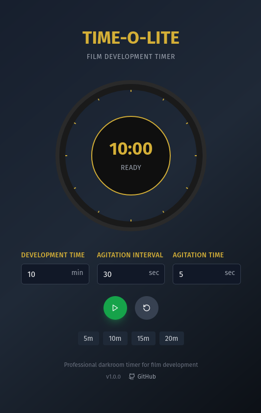

# Time-O-Lite

A specialized timer application designed for film development in darkroom photography. Features agitation alerts, persistent settings, and a vintage-inspired interface perfect for darkroom work.



## Features

- **Film Development Timer**: Customizable duration timer specifically designed for film development processes
- **Agitation Alerts**: Configurable interval alerts with customizable duration to remind you when to agitate your film
- **Audio Feedback**: Different sounds for agitation start, end, and timer completion using Web Audio API
- **Screen Wake Lock**: Prevents your device screen from sleeping during timing sessions (mobile-friendly)
- **Persistent Settings**: Your timer preferences are automatically saved using localStorage
- **Vintage UI**: Darkroom-inspired interface with gold and dark theme colors
- **Cross-Platform**: Works on desktop and mobile browsers

## Getting Started

### Prerequisites

- Node.js (version 16 or higher)
- npm or pnpm

### Installation

1. Clone the repository:

```bash
git clone <repository-url>
cd time-o-lite
```

2. Install dependencies:

```bash
npm install
# or
pnpm install
```

3. Start the development server:

```bash
npm run dev
# or
pnpm dev
```

4. Open your browser and navigate to `http://localhost:5173`

### Building for Production

```bash
npm run build
# or
pnpm build
```

The built files will be in the `dist` directory.

## Usage

1. **Set Development Time**: Configure how long your film development process will take
2. **Configure Agitation**: Set the interval between agitation alerts and how long each agitation should last
3. **Start Timer**: Press start and the timer will begin counting down
4. **Agitation Alerts**: Audio cues will alert you when to start and stop agitating your film
5. **Screen Lock**: Your screen will automatically stay on during the timing process

## Technology Stack

- **React 18.3.1** with TypeScript for the user interface
- **Vite 5.4.2** for fast development and building
- **Tailwind CSS 3.4.1** with custom vintage photography theme
- **Lucide React** for iconography
- **Web Audio API** for cross-browser audio alerts
- **Wake Lock API** for preventing screen sleep

## Project Structure

```
src/
├── App.tsx                 # Main application component
├── main.tsx               # Application entry point
├── components/
│   ├── CircularTimer.tsx  # SVG-based circular timer display
│   └── Controls.tsx       # Timer controls and settings
└── hooks/
    ├── useTimer.ts        # Core timer logic and state management
    └── useLocalStorage.ts # Persistent storage hook
```

## Development Commands

```bash
# Start development server
npm run dev

# Build for production
npm run build

# Run linting
npm run lint

# Preview production build
npm run preview
```

## Contributing

1. Fork the repository
2. Create a feature branch (`git checkout -b feature/amazing-feature`)
3. Make your changes
4. Run the linter (`npm run lint`)
5. Commit your changes (`git commit -m 'Add some amazing feature'`)
6. Push to the branch (`git push origin feature/amazing-feature`)
7. Open a Pull Request

## Browser Compatibility

- Modern browsers with ES2015+ support
- Wake Lock API support (Chrome 84+, Edge 84+, Opera 70+)
- Web Audio API support (all modern browsers)

## License

This project is open source and available under the [MIT License](LICENSE).

## Acknowledgments

- Designed for film photography enthusiasts and darkroom practitioners
- Inspired by traditional darkroom timing practices
- Built with modern web technologies for reliability and cross-platform compatibility
- Bolt.new for initial application and design inspiration
- Claude Code for polish and feature enhancements
- No affiliation with Time-O-Lite or any trademarked entities
